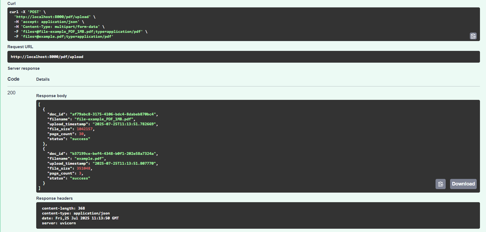
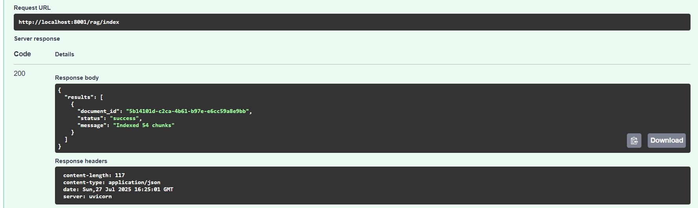
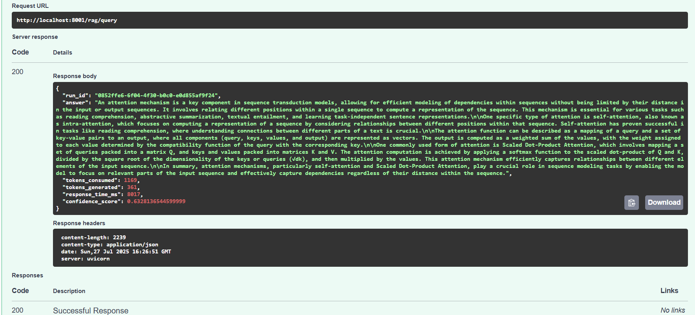
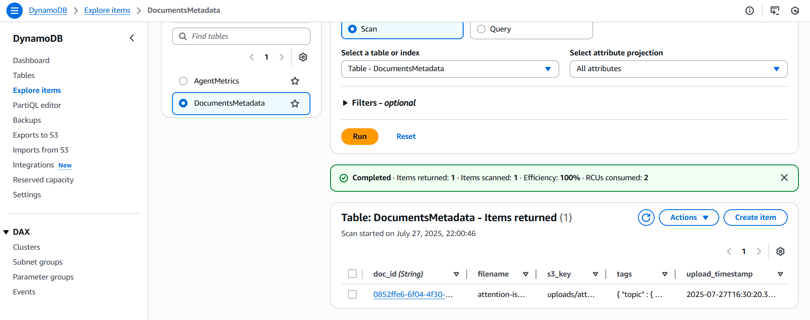
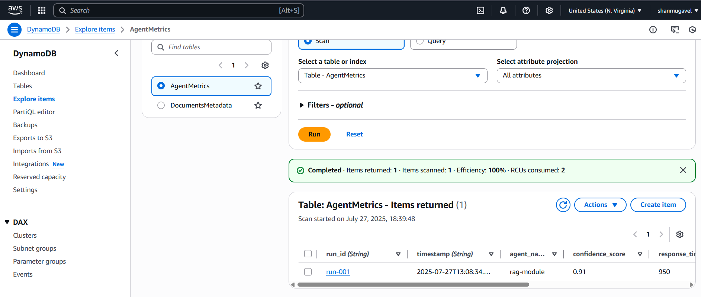
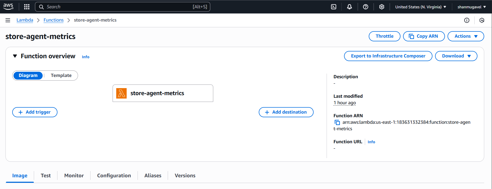
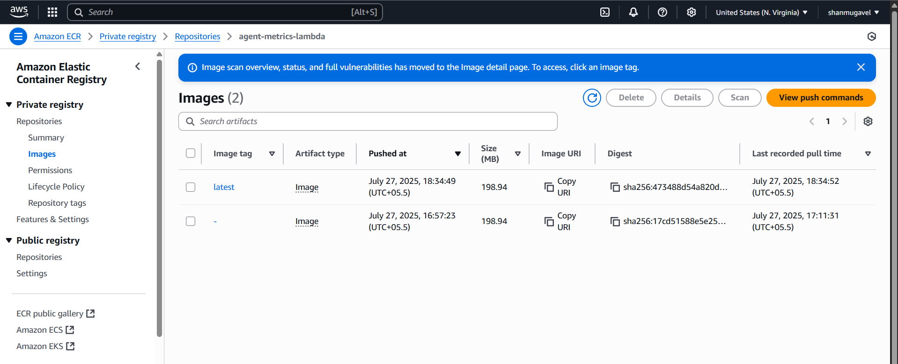
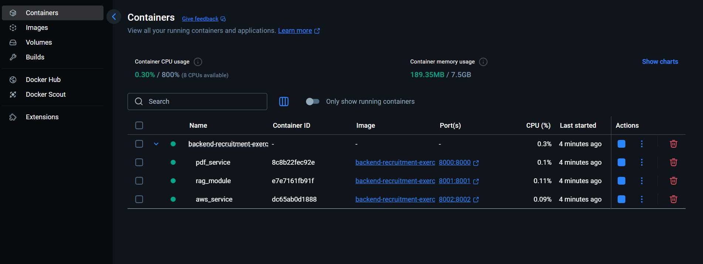

# Backend Recruitment Exercise

A containerized backend system composed of multiple FastAPI services and an AWS Lambda function for PDF processing, RAG (Retrieval Augmented Generation), and metrics collection.

## Architecture Overview

The system consists of four main components:

1. **PDF Service** (Port 8000): Handles PDF uploads, text extraction, and metadata storage
2. **RAG Module** (Port 8001): Document chunking, Pinecone indexing, and query processing
3. **AWS Service** (Port 8002): DynamoDB + S3 CRUD operations and RAG forwarding
4. **Agent-Metrics Lambda**: Receives and stores query metrics in DynamoDB

## Features

- **PDF Processing**: Upload PDFs, extract text, store metadata
- **RAG Pipeline**: Document chunking, embedding generation, vector search, LLM-powered answers
- **Cloud Integration**: DynamoDB for metadata, S3 for file storage, Pinecone for vector search
- **Metrics Collection**: Comprehensive query metrics tracking via Lambda
- **Containerized Deployment**: Docker Compose orchestration for all services

## Prerequisites

- Docker and Docker Compose
- Python 3.12+ (for local development)
- OpenAI API key
- Pinecone API key
- AWS credentials (for production deployment)

## Usage

1. Upload a PDF to the PDF Service
2. Query the RAG Module with a question
3. View metrics in the Agent-Metrics Lambda


## Environment Variables

# PDF Service Config
- PDF_SERVICE_URL= URL of the PDF Service
- PDF_SERVICE_TIMEOUT= Timeout (in seconds) for PDF service requests

# Metrics Lambda Config
- METRICS_LAMBDA_URL= URL of the Agent-Metrics Lambda
- METRICS_TIMEOUT= Timeout (in seconds) for metrics service requests

# AWS Config
- AWS_REGION= AWS region where resources (like Lambda) reside

# OpenAI Config
- OPENAI_API_KEY= API key to authenticate with OpenAI

# Pinecone Config
- PINECONE_API_KEY= API key for accessing Pinecone vector DB
- PINECONE_ENVIRONMENT= Environment name for Pinecone
- PINECONE_INDEX_NAME= Index name in Pinecone used for vector storage
- PINECONE_METRIC= Metric type for Pinecone vector DB (e.g., cosine)
- PINECONE_CLOUD= Cloud provider for Pinecone (e.g., aws)
- PINECONE_REGION= Region for Pinecone (e.g., us-east-1)

# Chunking Config
- CHUNK_SIZE= Number of tokens per chunk
- CHUNK_OVERLAP= Number of tokens to overlap between chunks

# Retrieval & Generation Config
- TOP_K= Number of top results to return
- EMBEDDING_MODEL= Embedding model to use (e.g., text-embedding-3-small)
- LLM_MODEL= LLM model to use (e.g., gpt-3.5-turbo)
- MAX_TOKENS= Maximum number of tokens to generate
- TEMPERATURE= Temperature for LLM generation
- EMBEDDING_DIMENSION= Dimension of embedding vector


## Quick Start

### 1. Environment Setup

Copy the environment template and configure your API keys:

```bash
cp .env.example .env
```

Edit `.env` file with your API keys:

```env
OPENAI_API_KEY=your_openai_api_key_here
PINECONE_API_KEY=your_pinecone_api_key_here
PINECONE_INDEX=documents
```

### 2. Start Services with Docker Compose

```bash
# Build and start all services
docker-compose up --build

# Or run in background
docker-compose up -d --build
```

Services will be available at:
- PDF Service: http://localhost:8000/docs
- RAG Module: http://localhost:8001/docs  
- AWS Service: http://localhost:8002/docs

### 3. Test the System

#### Upload a PDF
```bash
curl.exe -X POST http://localhost:8000/pdf/upload -F "files=@./pdfs/example.pdf"
```
#### Index Documents for RAG
```bash
Invoke-RestMethod -Uri http://localhost:8001/rag/index -Method POST -Body (@{ document_ids = @(DOC_ID) } | ConvertTo-Json) -ContentType "application/json"
```
#### Query the RAG Module
```bash
Invoke-RestMethod -Uri http://localhost:8001/rag/query -Method POST -Body (@{ question = "Explain about attention is all you need"; document_ids = @("DOC_ID") } | ConvertTo-Json -Depth 10) -ContentType "application/json"
```

#### Creates an item in DynamoDB’s DocumentsMetadata table.
```bash
Invoke-RestMethod -Uri http://localhost:8002/aws/documents -Method Post -Body (@{doc_id=DOC_ID;filename="attention-is-all-you-need-Paper.pdf";tags=@{topic="technology";quarter="q2"};s3_key="uploads/attention-is-all-you-need.pdf"} | ConvertTo-Json -Depth 3) -ContentType "application/json"
```

#### Get Document Metadata
```bash
Invoke-RestMethod -Uri http://localhost:8002/aws/documents/DOC_ID -Method Get
```

#### Update Document Metadata
```bash
Invoke-RestMethod -Uri http://localhost:8002/aws/documents/DOC_ID -Method Put -Body (@{filename="attention-is-all-you-need-Paper2.pdf";tags=@{topic="technology";quarter="q3"}} | ConvertTo-Json -Depth 3) -ContentType "application/json"
```

#### Delete Document
```bash
Invoke-RestMethod -Uri http://localhost:8002/aws/documents/DOC_ID -Method Delete
```

#### Returns a status indicating success or failure.
```bash
Invoke-RestMethod -Uri http://localhost:8002/aws/documents/69400b9a-410b-4e25-a6db-c7430426e590/index -Method Post
```

#### Returns the RAG Module’s response (answer + metrics).
```bash
Invoke-RestMethod -Uri http://localhost:8002/aws/query -Method Post -Body (@{document_ids=@(DOC_ID);question="Explain about the attention mechanism?"} | ConvertTo-Json -Depth 3) -ContentType "application/json"
```

## AWS Setup Guide

### 1. Create an IAM User

1. Go to [IAM Console](https://console.aws.amazon.com/iam).
2. Click **Users** > **Add users**.
3. Enter a username (e.g., `backend-user`) and enable **Programmatic access**.
4. Click **Next**, attach the following policies:

   * `AmazonS3FullAccess`
   * `AmazonDynamoDBFullAccess`
   * `AWSLambda_FullAccess`
   * `CloudWatchFullAccess`
   * `AmazonEC2ContainerRegistryFullAccess`
5. Click **Next** through the rest and **Create User**.
6. Save the **Access Key ID** and **Secret Access Key** securely.

---

### 2. Configure AWS CLI

Install and configure the CLI:

```bash
pip install awscli
aws configure
```

You'll be prompted to enter:

* Access Key ID
* Secret Access Key
* Default region (e.g., `us-east-1`)
* Output format (e.g., `json`)

---

### 3. Create an S3 Bucket

```bash
aws s3 mb s3://your-bucket-name --region us-east-1
```

Make sure the bucket name is globally unique.

To allow public read or configure specific permissions, update the bucket policy via AWS Console or CLI.

---

### 4. Create a DynamoDB Table

```bash
aws dynamodb create-table \
    --table-name YourTableName \
    --attribute-definitions AttributeName=doc_id,AttributeType=S \
    --key-schema AttributeName=doc_id,KeyType=HASH \
    --provisioned-throughput ReadCapacityUnits=5,WriteCapacityUnits=5 \
    --region us-east-1
```

Update `YourTableName` and attributes as per your app schema.

---

### 5. Deploy Docker Container to AWS

#### A. Build and Tag Your Docker Image

```bash
docker build -t your-backend-app .
docker tag your-backend-app:latest <aws_account_id>.dkr.ecr.us-east-1.amazonaws.com/your-backend-app:latest
```

#### B. Push Image to ECR

1. Create a repository:

```bash
aws ecr create-repository --repository-name your-backend-app
```

2. Authenticate Docker with ECR:

```bash
aws ecr get-login-password --region us-east-1 | docker login --username AWS --password-stdin <aws_account_id>.dkr.ecr.us-east-1.amazonaws.com
```

3. Push image:

```bash
docker push <aws_account_id>.dkr.ecr.us-east-1.amazonaws.com/your-backend-app:latest
```

---

### 6. Create a Lambda Function (Image-based)

```bash
aws lambda create-function \
    --function-name your-lambda-function \
    --package-type Image \
    --code ImageUri=<aws_account_id>.dkr.ecr.us-east-1.amazonaws.com/your-backend-app:latest \
    --role arn:aws:iam::<aws_account_id>:role/YourLambdaExecutionRole \
    --region us-east-1
```

Make sure:

* The IAM role `YourLambdaExecutionRole` has `AWSLambdaBasicExecutionRole` and necessary permissions (e.g., to access DynamoDB/S3).
* The ECR image is built with a handler for Lambda (e.g., `/var/task/app.lambda_handler` if using Python).

---


## Demo Evidence

### Multiple PDFs are uploaded to the PDF Service


### Indexing and Embedding Documents


### Querying RAG Module


### Documents Metadata


### Agent-Metrics Metadata


### Lambda Function



### Docker Containers

